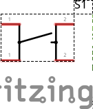
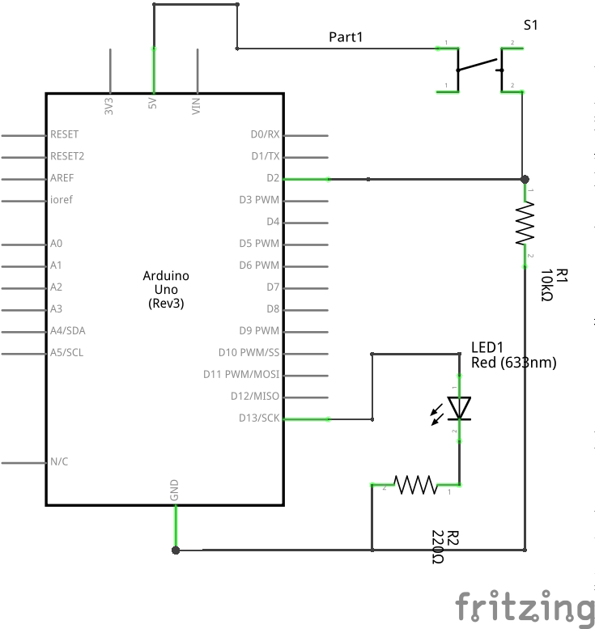

# Introdução

Neste projeto adicionamos um Pushbutton ao nosso circuito com LED.

O Pushbutton é um botão que retorna ao estado normal quando é solto (ao invés de permanecer pressionado como um interruptor).
Dentre seus 4 terminais, 2 pares ficam sempre conectados entre si, porém todos se conectam quando o botão é pressionado.

Essa é a razão de sua representação em circuito elétrico ser a seguinte:

## Desenho

### Protoboard

### Elétrico

## Código

- [pushbutton.ino](src/pushbutton/pushbutton.ino)
- [exemplo mínimo](src/pushbutton/pushbutton-minimo.ino)
- [versão 'toggle'](src/pushbutton/pushbutton-toggle.ino)

## Conceitos

- Entendimento mais profundo do `loop()`
- Variáveis globais para acompanhamento de estado
- pinMode INPUT