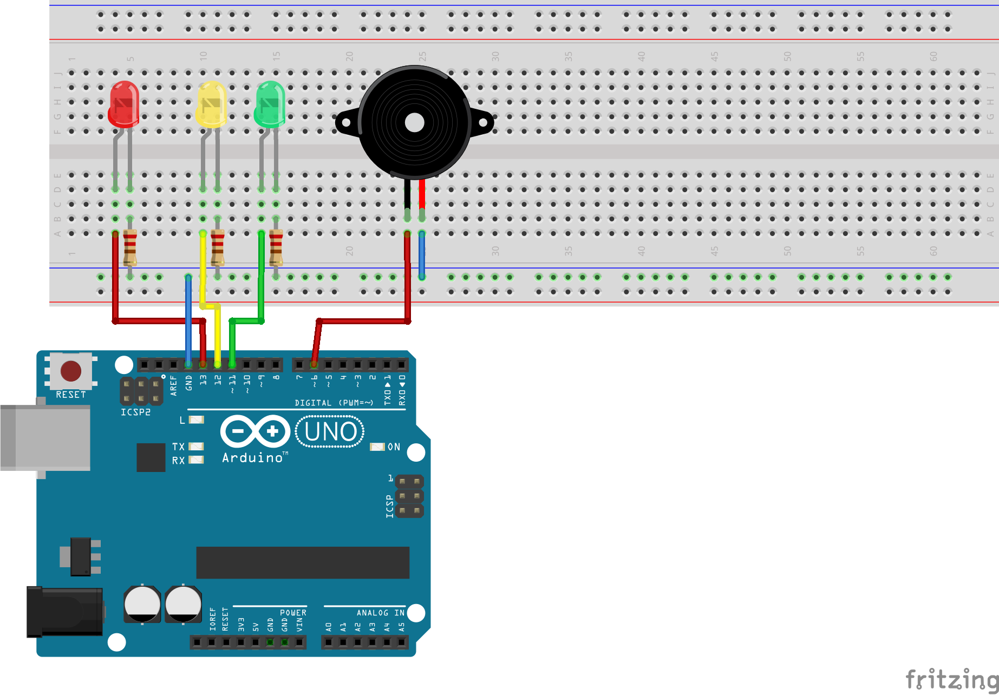

# Cores e Buzzer

Nesta aula vamos ver como se comunicar com o arduino durante a execução de um programa através do próprio cabo USB.

Também veremos o Buzzer, um componente que consegue emitir sons ao receber impulsos elétricos.

## Desenho

### Protoboard

### Elétrico

## Conceitos
- Estrutura `case`
- Função `tone()`
- Comunicação com a IDE via Serial
- Declaração de funções
- Escopo de variáveis