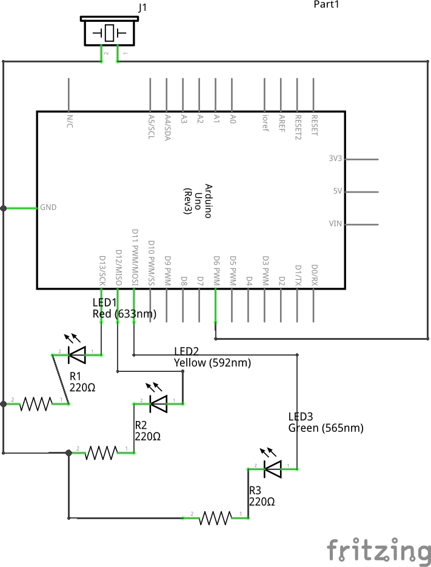

# Comunicação Serial

Nesta aula vamos ver como se comunicar com o arduino durante a execução de um programa através do próprio cabo USB.

Também veremos o Buzzer, um componente que consegue emitir sons ao receber impulsos elétricos.

## Proposta do exercício

Em cima do esquema abaixo, fazer com que com base no valor digitado pelo usuário,
um LED acenda, uma frequencia diferente toque no Buzzer e uma mensagem seja retornada pela comunicação serial:

- < 30 graus: frequencia `4186`, mensagem: **Temperatura normal**, acender somente led VERDE
- < 40 graus: frequencia `523`, mensagem: **Temperatura perigosa**, acender somente led AMARELO
- além de 40: frequencia `131`, mensagem: **Temperatura crítica**, acender somente led VERMELHO

## Desenho

### Protoboard

### Elétrico

## Código

- [Exercício completo](./src/temperaturas/temperaturas.ino)
- [Leitura dos nomes das cores](./src/temperaturas/temperaturas-nomes.ino)
- [Utilizando evento SerialEvent()](./src/temperaturas/temperaturas-event.ino)

## Conceitos
- Estrutura `for`
- Função `tone()`
- Comunicação com a IDE via Serial
- Declaração de funções
- Escopo de variáveis
