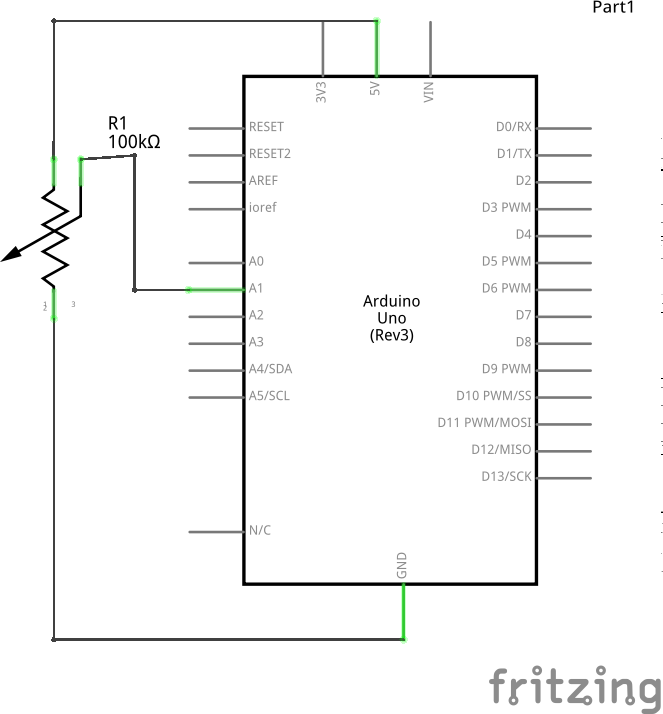
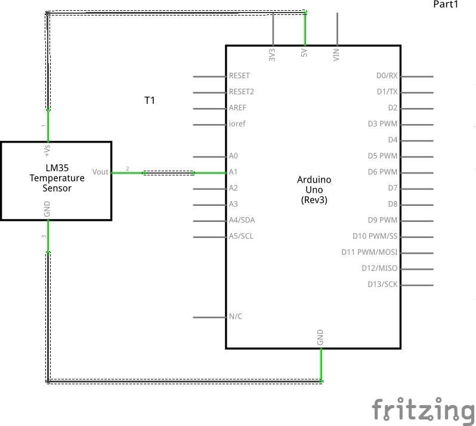

# Primeiros sensores analógicos

Nesta aula vamos ver como captar e processar a informação vindo de fontes analógicas

## Proposta do exercício

Para cada sensor, aprender como ler valores deles numa escala correta.

## Desenho

### Protoboard

#### Potenciometro

#### Temperatura

#### Luz

### Elétrico

#### Potenciometro

#### Temperatura

#### Luz

## Código

- Exemplo potenciometro
- Exemplo temperatura (LM35)
- Exemplo sensor de luz

## Links

- [Datasheet LM35](http://www.ti.com/lit/ds/symlink/lm35.pdf) (sensor de temperatura)
- [Documentação para equação do sensor de temperatura](https://playground.arduino.cc/Main/LM35HigherResolution)
- [Descrição dos pinos analógicos do arduino](https://www.arduino.cc/en/Tutorial/AnalogInputPins)

Detalhe do datasheet LM35:

## Conceitos
- Leitura de dados analógicos
- Potenciômetro
- Sensor de luz
- Sensor de temperatura
- Função `map()`