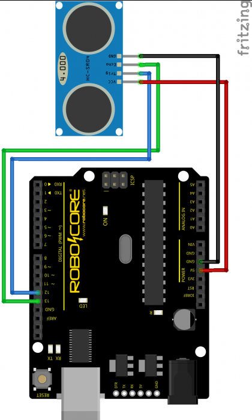

# Ultrassom

Nesta aula veremos como utilizar o sensor ultrassom.

Ele consiste em um componente que possui um circuito de alimentação fixo de 5V (`Vcc` e `GND`), e um ou dois pinos para comunicação, de maneira análoga aos sensores de temperatura e potenciômetro, que também devem ser alimentados por um circuito elétrico permanente além dos pinos utilizados para comunicação.

## Cenário proposto

- Utilizar o sensor ultrassom em um Sketch Arduino.
- Utilizar a biblioteca [Ultrasonic](https://github.com/ErickSimoes/Ultrasonic) para manipular o componente

Executar os seguintes exercícios:

### Básico
- Observar dados de distância via comunicação Serial

### Único LED
- Ligar um LED caso a distância medida seja menor do que um determinado valor

### Múltiplos LEDs e Buzzer
- Ligar um LED de cor Amarela caso a distância a um obstáculo seja razoável
- Ligar um LED de cor Vermelha caso a distância a um obstáculo seja curta
- Tocar som em um Buzzer caso um obstáculo esteja muito próximo

**NOTA**: As distâncias nos exemplos de código devem ser alteradas a fim de possibilitar os testes com os componentes físicos.

## Utilizando a biblioteca Ultrasonic

1. Vá em `Sketch > Incluir Biblioteca > Gerenciar Bibliotecas...` e instale a biblioteca `Ultrasonic` em sua última versão. Dentre as diversas bibliotecas com este nome, estamos utilizando a pelo autor Erick Simões
2. Vá em `Sketch > Incluir Biblioteca > Ultrasonic`

## Desenho

### Protoboard

## Código
- [Básico](../exercicios/07-ultrassom/01-basico/ultrassom.ino)
- [Único LED](../exercicios/07-ultrassom/02-led-ligar-desligar/ultrassom_led.ino)
- [Múltiplos LEDs e Buzzer](../exercicios/07-ultrassom/03-portugol/portugol.ino)
