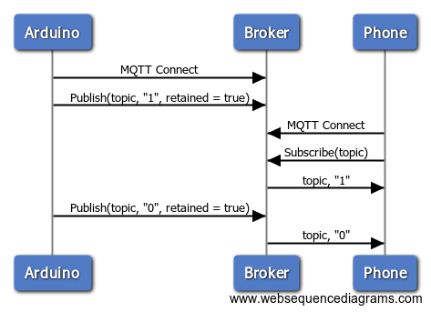

# MQTT - Retain e Will

Nesta aula iremos ver como utilizar as features do protocolo MQTT que lidam com armazenamento de mensagem em tópicos (*Retain*) e Testamento (*Will*).

## Retain
Quando um cliente publica uma mensagem em um tópico, ele pode pedir ao broker que retenha/armazene essa mensagem para que seja recebida por um próximo cliente assim que ele se inscrever ao tópico.

Essa mensagem é mantida até ser substituída por outra, **mesmo após o cliente que a publicou originalmente se desconectar**.

A imagem a seguir ilustra o que acontece com mensagens sem a marcação de *Retain*, observe que subscriber não recebe a primeira mensagem enviada antes de se conectar e inscrever-se no tópico:


Caso a mensagem esteja retida na memória do broker, novos clientes a recebem assim que se inscrevem no tópico:



### Retain na biblioteca PubSubClient

Para publicar uma mensagem que deve ser mantida pelo broker com a biblioteca `PubSubClient`, basta adicionar um último boolean `true` no método `PubSubClient::publish()`:

```c++
PubSubClient client(server, port, callback, ethernetClient);

// ...

client.publish("topico", "mensagem", true);
```

Esta assinatura da função `publish` está documentada [aqui](https://pubsubclient.knolleary.net/api.html#publish2).

## Will

Quando um cliente MQTT se desconecta normalmente do broker, ele envia uma mensagem final de DISCONNECT, avisando que está se desconectando. Se essa mensagem não for enviada por algum motivo (queda brusca na conexão, término da bateria do Arduino, etc), o broker pode publicar uma mensagem final em nome do cliente que se desconectou.

A configuração da mensagem de testamento deve ser feita quando o cliente se conecta:

```c++
PubSubClient client(server, port, callback, ethernetClient);
//...
client.connect("meu-clientid", "usuario", "senha", // informações normais de login
	"topico-testamento", // topico em qual publicar a mensagem de Will
	0, // QoS da mensagem de Will
	false, // Retain para mensagem de Will
	"mensagem-testamento" // Payload da mensagem de Will
	);
```

## Cenário Proposto

- Conectar o Arduino a um broker MQTT via Ethernet
- Ligar/Desligar um LED baseado em um tópico de estado (ex.: `"luz"`)
- Caso o Arduino se desconecte repentinamente, o tópico de estado do LED deve reportado como deligado (Will message)
- Caso um cliente se conectar quando o LED estiver aceso, ele deve receber imediatamente esta informação do broker (Retained message)

## Links

- [Retained Messages](https://www.hivemq.com/blog/mqtt-essentials-part-8-retained-messages)
- [Last Will and Testament](https://www.hivemq.com/blog/mqtt-essentials-part-9-last-will-and-testament)
